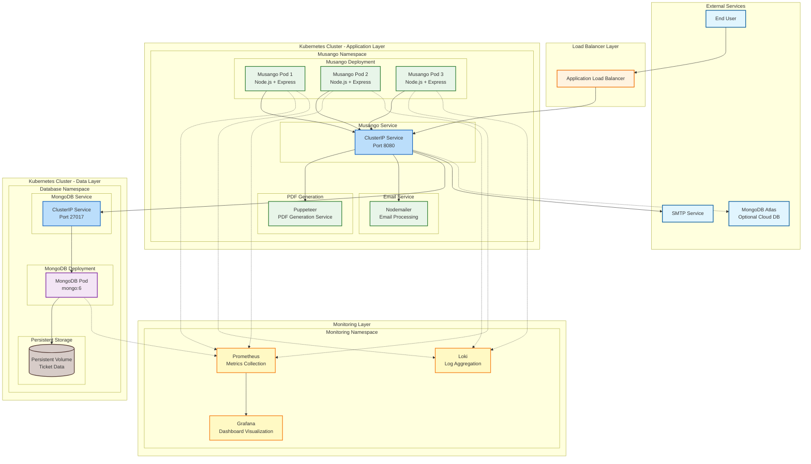

# Musango Express: Enterprise Ticket Management Platform


## Overview

Musango Express is a comprehensive enterprise-grade ticket management platform designed for modern transportation systems. Built with scalability and reliability in mind, this platform handles ticket booking, management, and customer communications with robust backend services and an intuitive user interface.


## 🏗️ Architecture Overview



## Features

### 🎫 Core Ticket Management
- **Online Booking System**: Seamless ticket reservation with real-time availability
- **PDF Ticket Generation**: Automated ticket generation with Puppeteer
- **Email Confirmations**: Automated email notifications with Nodemailer
- **Booking Management**: Full CRUD operations for ticket management
- **Customer Portal**: Self-service booking modifications and cancellations

### 🏗️ Enterprise Architecture
- **Microservices Ready**: Containerized architecture with Docker
- **Database Persistence**: MongoDB with optimized queries and indexing
- **Kubernetes Orchestration**: Production-ready deployment manifests
- **CI/CD Pipeline**: Automated testing and deployment with CircleCI
- **Multi-environment Support**: Development, staging, and production configurations

### 🔧 Technical Excellence
- **EJS Templating**: Server-side rendering with dynamic content
- **RESTful APIs**: Clean API design for integration and extensibility
- **Chromium Automation**: PDF generation with headless browser automation
- **Email Integration**: SMTP integration for customer communications
- **Health Monitoring**: Comprehensive monitoring and logging

## 🛠️ Tech Stack

### Backend
- **Node.js** with Express.js framework
- **MongoDB** with Mongoose ODM
- **EJS** for server-side templating
- **Puppeteer** for PDF generation
- **Nodemailer** for email services

### Frontend
- **HTML5** with semantic markup
- **CSS3** with responsive design
- **JavaScript** with modern ES6+ features
- **Bootstrap** for UI components (if used)

### Infrastructure
- **Docker** for containerization
- **Kubernetes** for orchestration
- **CircleCI** for continuous integration
- **AWS EC2/EKS** for cloud deployment
- **MongoDB Atlas** (optional) for managed database

## 🚀 Quick Start

### Prerequisites

```bash
# Install Node.js and npm
curl -fsSL https://deb.nodesource.com/setup_18.x | sudo -E bash -
sudo apt-get install -y nodejs

# Install Docker
sudo apt-get update
sudo apt-get install docker.io -y
sudo systemctl start docker
sudo systemctl enable docker

# Install Kubernetes tools (optional)
sudo apt-get install -y kubectl
```

### Local Development

```bash
# Clone the repository
git clone https://github.com/CHAFAH/musango-app.git
cd musango-app

# Install dependencies
npm install

# Set up environment variables
cp .env.example .env
# Edit .env with your configuration

# Start MongoDB with Docker
docker run -d --name mongodb -p 27017:27017 \
  -e MONGO_INITDB_DATABASE=musango-express \
  mongo:6

# Test database connection
node test-db.js

# Start the application
npm run dev
```

### Docker Deployment

```bash
# Build the Docker image
docker build -t musango-express:latest .

# Run MongoDB
docker run -d --name mongodb -p 27017:27017 \
  -e MONGO_INITDB_DATABASE=musango-express \
  mongo:6

# Run the application
docker run -d -p 8080:8080 \
  --name musango-app \
  --link mongodb:mongodb \
  -e MONGO_URI=mongodb://mongodb:27017/musango-express \
  -e PORT=8080 \
  musango-express:latest
```

## ☸️ Kubernetes Deployment

### Prerequisites
- Kubernetes cluster (EKS, GKE, AKS, or Minikube)
- kubectl configured for your cluster
- Docker registry access

### Deployment Steps

```bash
# Apply MongoDB deployment
kubectl apply -f kubernetes/mongo-deployment.yaml

# Apply Musango Express deployment
kubectl apply -f kubernetes/musango-deployment.yaml

# Check deployment status
kubectl get pods,svc,deploy

# Access the application
kubectl port-forward svc/musango-service 8080:8080
```

## 🔧 Configuration

### Environment Variables

| Variable | Description | Default | Required |
|----------|-------------|---------|----------|
| `PORT` | Application port | `8080` | No |
| `MONGO_URI` | MongoDB connection string | `mongodb://localhost:27017` | Yes |
| `DB_NAME` | Database name | `musango-express` | No |
| `EMAIL_HOST` | SMTP host for email | - | Yes |
| `EMAIL_PORT` | SMTP port | `587` | No |
| `EMAIL_USER` | SMTP username | - | Yes |
| `EMAIL_PASS` | SMTP password | - | Yes |
| `NODE_ENV` | Environment mode | `development` | No |


### CI/CD Pipeline (CircleCI)

```yaml
# .circleci/config.yml
version: 2.1
jobs:
  build:
    docker:
      - image: circleci/node:18
    steps:
      - checkout
      - run: npm install
      - run: npm test
      - run: npm run build

  deploy:
    docker:
      - image: circleci/node:18
    steps:
      - checkout
      - setup_remote_docker
      - run: docker build -t musango-express:${CIRCLE_SHA1} .
      - run: docker push musango-express:${CIRCLE_SHA1}
```

## 🔒 Security Features

- **Helmet.js**: Security headers protection
- **CORS**: Configured cross-origin resource sharing
- **Input Validation**: Request data sanitization
- **Environment Configuration**: Secure credential management
- **Docker Security**: Non-root user execution
- **Kubernetes Security**: Pod security contexts

## 📈 Performance Optimization

- **Database Indexing**: Optimized MongoDB queries
- **Connection Pooling**: Efficient database connections
- **Caching Ready**: Redis integration prepared
- **Compression**: Response compression middleware
- **Static File Serving**: Optimized asset delivery


## 🤝 Contributing

We welcome contributions to enhance Musango Express:

1. Fork the repository
2. Create a feature branch (`git checkout -b feature/amazing-feature`)
3. Commit your changes (`git commit -m 'Add amazing feature'`)
4. Push to the branch (`git push origin feature/amazing-feature`)
5. Open a Pull Request

## 📄 License

This project is licensed under the MIT License - see the [LICENSE](LICENSE) file for details.

## 📞 Contact

**Musango Express Team** - [support@musangoexpress.com](mailto:support@musangoexpress.com)

**Sani Chafah** - [prsan@nebulancesystems.com](mailto:prsan@nebulancesystems.com)

[](https://www.linkedin.com/in/sani-chafah/)
[](https://github.com/CHAFAH)
[](https://sani-chafah.com)

**Project Link:** [https://github.com/CHAFAH/musango-app](https://github.com/CHAFAH/musango-app)

---

**⭐ Star this repo if you found it useful!**

---

*Musango Express demonstrates enterprise-grade ticket management with modern DevOps practices and cloud-native deployment patterns.*
